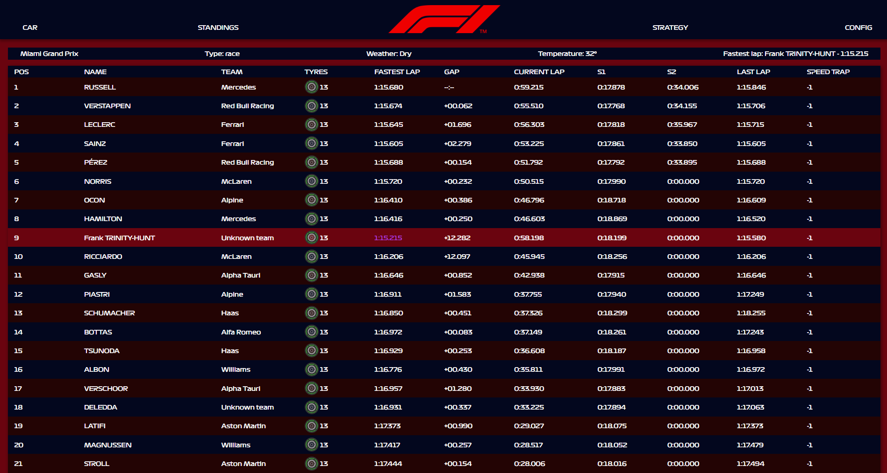

# F1-2022 Real-time Telemetry Analyzer

This project is a real-time telemetry application for the Formula 1 2022 video game, leveraging UDP technology to process in-game data in real-time. Built with Electron, Vue 3, and Vite, it provides an intuitive and engaging desktop experience across multiple platforms (Windows, macOS).

## Features

Currently, the following feature has been fully developed:

- **Position Tracking**: Get real-time updates on the current positions of all drivers in the race. 

Future planned features include:

- **Speed Monitoring**: View your current speed and compare it with the average speed.
- **Tire Pressure**: Monitor tire pressure to strategize pit stops.
- **Fuel Usage**: Keep track of fuel consumption to optimize performance.
- **Detailed Analysis**: Comprehensive charts and graphs for a deeper understanding of your performance.

## Contributing

We welcome contributions! Please feel free to fork the repository and submit pull requests. For major changes, open an issue first to discuss what you would like to change.

## Showcase

## License

This project is licensed under the MIT License.

## Acknowledgements

A big thank you to the F1 2022 community for their support and contributions.
